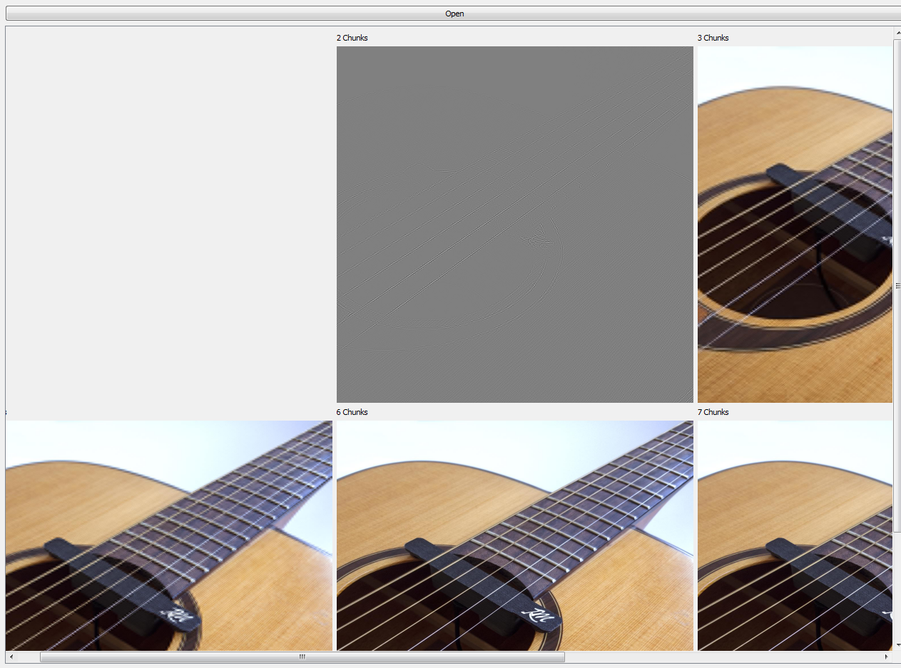
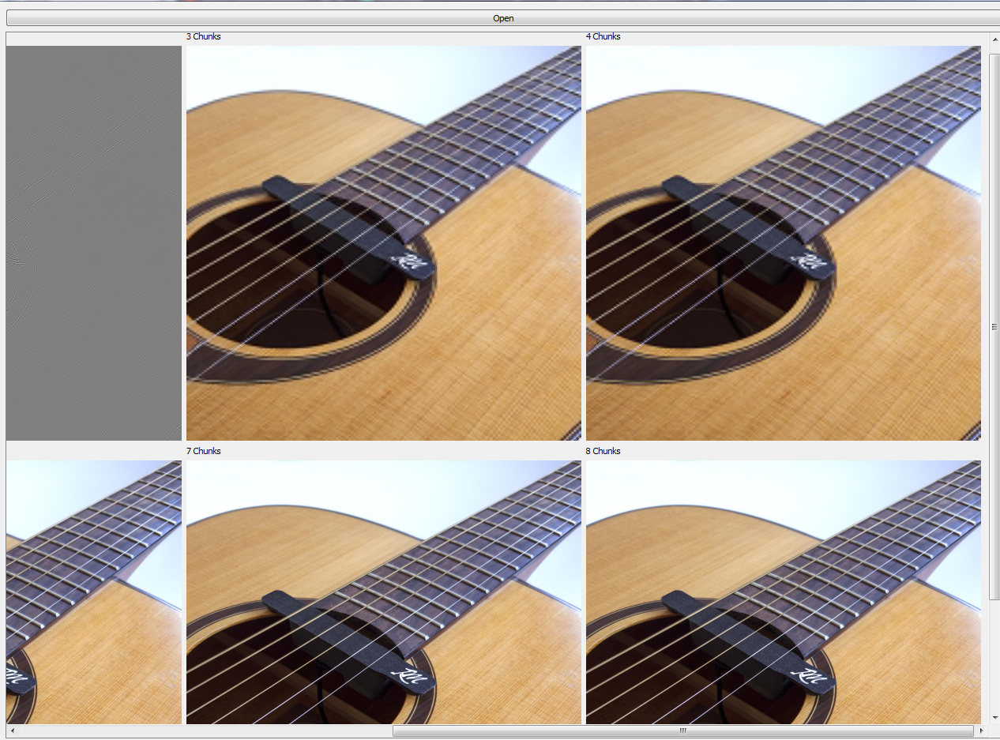

# Problem 2
It about display JPEG Progressive

# Method 
We read JPEG image then take scan and show it as image and take another scan including previous scan , this scans depending on markers.

First image contains one scan, Second image contains two scans and so on.

```python
SOI = b'\xff\xd8'
SOS = b'\xff\xda'
EOI = b'\xff\xd9'
```
# Results

